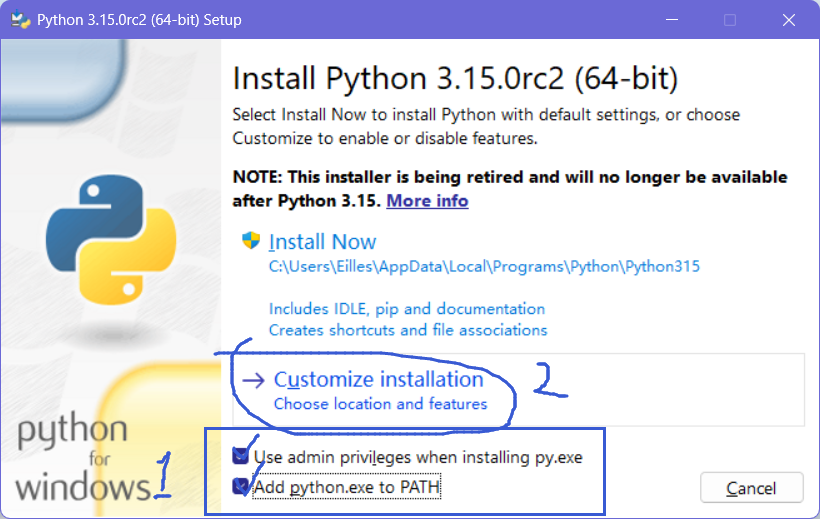
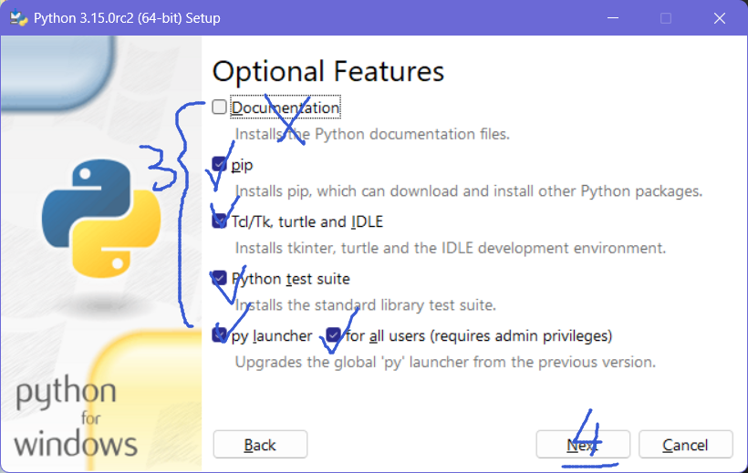
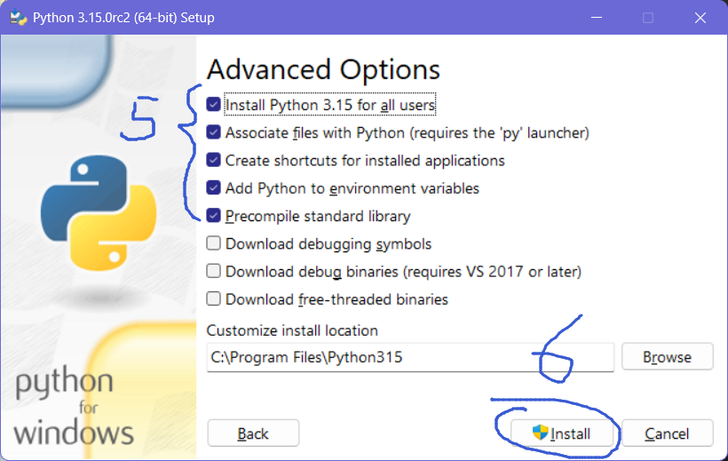

> 版权所有 © 2026 [菀金羿](https://github.com/EillesWan)
> 
> 保留所有权利。
>
> 文档遵循 [知识共享 署名—非商业性使用—相同方式共享 4.0 协议](https://creativecommons.org/licenses/by-nc-sa/4.0/deed.zh-hans) 协议发布，转载时请注明原地址及原作者信息以及本协议之地址，其中作者信息必须包括原作者的昵称（菀金羿或Eilles）、原作者的任意平台链接地址（[GitHub用户页](https://github.com/EillesWan)、[Bilibili个人页](https://space.bilibili.com/397369002)或其他个人页面）；未满足上述条件的任何使用都将被依法追究责任。

> Copyright © 2026 [Eilles](https://github.com/EillesWan),
> 
> All rights reserved.
>
> This document is licensed under the [Creative Commons Attribution-NonCommercial-ShareAlike 4.0 International License](https://creativecommons.org/licenses/by-nc-sa/4.0/deed). When reposting or redistributing, you must include the document's original link, original author information and the link to the license. The author information must include the author's name (Eilles) and any link address of the original author's personal page (like [Github Overview Page](https://github.com/EillesWan), or [Bilibili Space Page](https://space.bilibili.com/397369002), etc). Any use that does not meet the above conditions will be considered illegal.

## 安装运行环境

Python 是一款解释性程序设计语言，我们首先要在电脑上安装 Python 解释器才能够运行 Python 语言的代码。

首先，[点击此处即可从 Python 官网下载 Python 解释器](https://www.python.org/ftp/python/3.10.11/python-3.10.11-amd64.exe)，并如下图所示安装。

好了，安装完成，接下来，我们来测试一下 Python 是否安装成功。

> TODO: 未完待续。

<CommentService/>